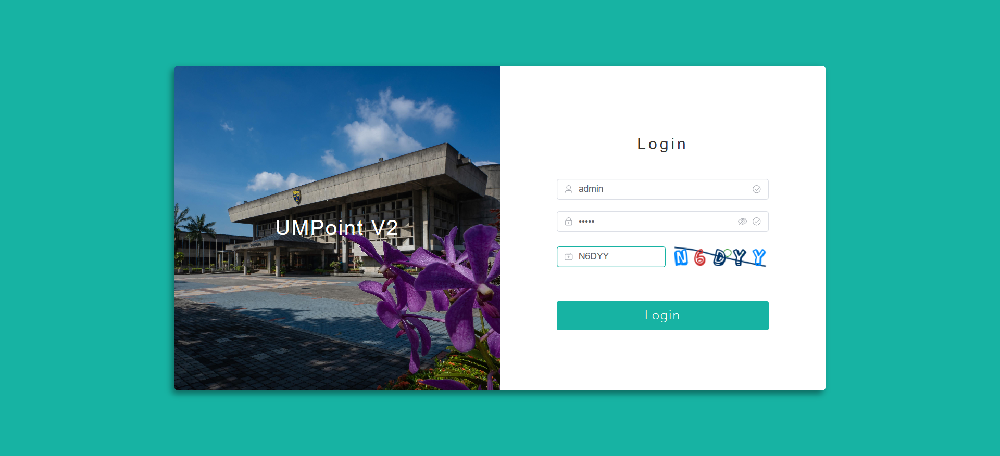
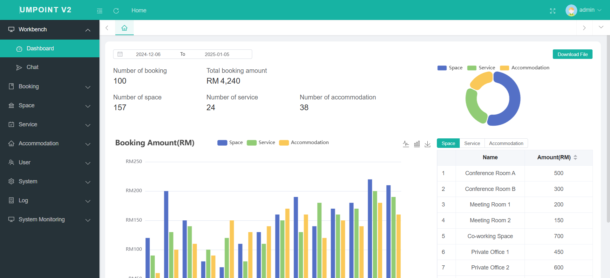
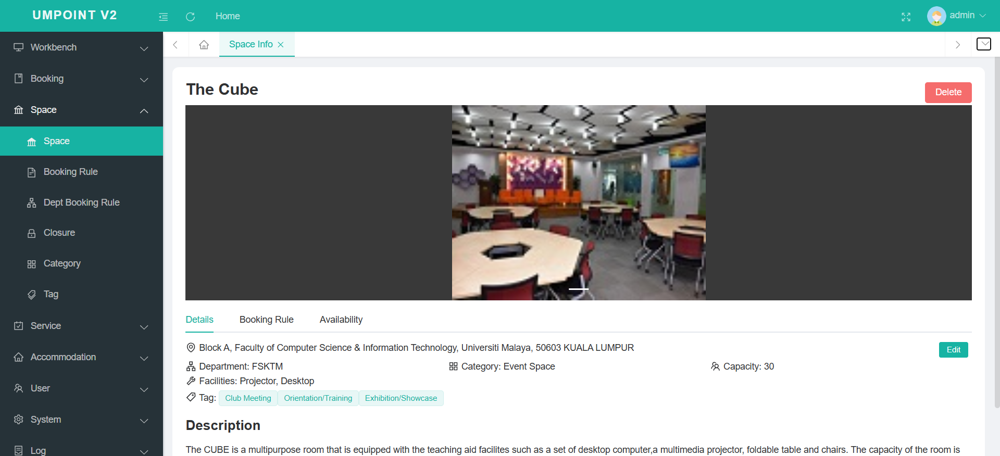

# UMPOINT V2 - Facility Reservation System

UMPOINT V2 is an advanced facility reservation system developed to replace the outdated system at UM. It allows staff, students, and the public (both individual and third-party users) to book spaces for events, lab equipment testing, and accommodations. The system is designed for scalability, performance, and an enhanced user experience.

## Features
- **Space Booking**: Book spaces for events and various activities.
- **Service Booking**: Book services like lab equipment testing.
- **Accommodation Booking**: Reserve accommodations for different purposes.
- **RBAC (Role-Based Access Control)**: Different user roles (staff, students, and public) with specific permissions.
- **Management**: Admin users can manage spaces, services, accommodations, and bookings.
- **Booking Management**: Users can view, modify, or cancel their bookings.

## Tech Stack
- **Frontend**:
    - **Vue (JavaScript)**: Provides a responsive and modern user interface.
- **Backend**:
    - **Spring Boot (Java)**: A robust and scalable backend framework.
- **Database**:
    - **MySQL**: Relational database used to store user and booking data.
- **Cache**:
    - **Redis**: Used to store dynamically changing data like closed spaces and time slots for quick retrieval.
- **Asynchronous Processing**:
    - **Kafka**: Used for managing asynchronous batch operations to improve system performance.
- **Authentication & Authorization**:
  - **Apache Shiro**: Provides secure authentication and authorization for the application.

## User Interface
### Client
### Admin

## License
This project is licensed under the Apache 2.0 License.